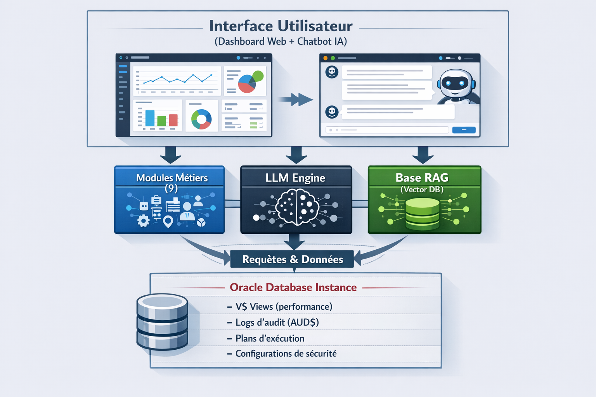

# 🏗️ Architecture de la Plateforme Oracle IA

## 1. Objectif de l’Architecture

L’architecture de cette plateforme a été conçue pour :

- séparer clairement les responsabilités (modularité),
- permettre l’intégration fluide de l’IA (LLM + RAG),
- rester simple, extensible et faisable dans un cadre académique,
- simuler une architecture **industry-ready** orientée observabilité et automatisation.

Elle repose sur une approche **modulaire**, où chaque composant peut évoluer indépendamment.

---

## 2. Vue d’Ensemble de l’Architecture

L’architecture globale s’articule autour de **5 couches principales** :

---

## 3. Couche 1 : Interface Utilisateur

### Rôle
- Point d’entrée unique de l’utilisateur
- Visualisation des résultats
- Interaction en langage naturel avec l’IA

### Composants
- Dashboard Web (Streamlit ou Flask)
- Chatbot conversationnel
- Pages dédiées :
  - Accueil
  - Sécurité
  - Performance
  - Sauvegardes
  - Base de connaissances (RAG)

---

## 4. Couche 2 : Modules Métiers (9 Modules)

Chaque fonctionnalité majeure est implémentée sous forme de **module indépendant** :

| Module | Rôle |
|------|------|
| Extraction | Récupération des données Oracle |
| RAG Setup | Base de connaissances vectorielle |
| LLM Engine  | Centralisation des appels IA |
| Audit Sécurité | Analyse des risques |
| Optimisation | Analyse des requêtes lentes |
| Anomalies | Détection de comportements suspects |
| Backup | Recommandation des sauvegardes |
| Restauration | Assistance à la récupération |
| Dashboard | Agrégation et affichage |

Cette modularité facilite :
- les tests unitaires,
- l’évolution du projet,
- la répartition du travail en binôme.

---

## 5. Couche 3 : LLM Engine & Prompt Engineering

### Rôle
- Interface unique entre les modules et le modèle de langage
- Centralisation des prompts
- Garantie de cohérence des réponses IA

### Fonctionnement
    1. Le module métier formule une demande
    2. Le LLM Engine prépare le prompt
    3. Le contexte RAG est injecté si nécessaire
    4. Le LLM génère une réponse expliquée

---

## 6. Couche 4 : Base de Connaissances (RAG)

### Objectif
Garantir que l’IA s’appuie sur :
- des sources Oracle fiables,
- des bonnes pratiques DBA,
- des exemples concrets.

### Composants
- Vector Database (ChromaDB ou Pinecone)
- Documents Oracle indexés (15–20)
- Recherche sémantique Top-K

### Avantage clé
    1. Pas de réponses génériques  
    2. Réponses contextualisées, justifiées et explicables

---

## 7. Couche 5 : Base de Données Oracle

### Rôle
Source unique de vérité technique.

### Données exploitées
- V$SQLSTAT, V$SQL_PLAN → performance
- AUD$ → audit & anomalies
- DBA_USERS, DBA_ROLES → sécurité
- RMAN metadata → sauvegarde/restauration

Les données peuvent être :
- extraites en temps réel,
- ou simulées via scripts SQL pour les tests.

---

## 8.  Flux de Données Simplifié

     1. Oracle fournit données brutes
     2. Modules les analysent
     3. RAG enrichit le contexte
     4. LLM génère explication + recommandation
     5. Dashboard affiche les résultats
     6. Chatbot permet l’interaction naturelle

---

## 9.  Choix Architecturaux Justifiés

- ✔️ Architecture modulaire → maintenabilité
- ✔️ RAG → fiabilité des réponses IA
- ✔️ Prompt Engineering → qualité et cohérence
- ✔️ Dashboard unique → vision globale
- ✔️ Compatible local (Ollama, ChromaDB) → faible coût

---

## 10. Conclusion

Cette architecture permet de **transformer une base Oracle classique en un système intelligent**, capable de s’auto-analyser, de détecter les risques et d’assister l’administrateur en continu.

> Elle constitue un excellent compromis entre **réalisme industriel**, **simplicité académique** et **innovation IA**.

