# Plateforme Intelligente de Gestion Oracle avec IA

## 1.  Présentation Générale

Ce projet consiste à développer une **plateforme intelligente de gestion et de supervision de bases de données Oracle**, intégrant de l’**intelligence artificielle** afin d’automatiser les tâches complexes traditionnellement réalisées par un administrateur de bases de données (DBA).

L’objectif est de proposer un **assistant intelligent disponible 24/7**, capable de surveiller, analyser, optimiser et sécuriser une base Oracle tout en communiquant avec l’utilisateur en **langage naturel** via un chatbot.

---

## 2. Le But Concret

Imaginez un assistant intelligent qui surveille et gère votre base de données Oracle en continu.

Au lieu qu’un administrateur doive :
- analyser manuellement les logs,
- chercher les causes des requêtes lentes,
- vérifier la sécurité,
- planifier les sauvegardes,
- intervenir en urgence lors des incidents,

la plateforme **automatise toutes ces tâches** et fournit des **recommandations claires, expliquées et actionnables**, en s’appuyant sur l’IA.

---

## 3. Le Problème Résolu

Les administrateurs Oracle passent beaucoup de temps à :

- Identifier pourquoi une requête SQL est lente
- Vérifier les failles de sécurité
- Détecter des comportements suspects dans les logs
- Gérer les stratégies de sauvegarde
- Intervenir rapidement lors de pannes critiques

Ce projet vise à **réduire la charge humaine**, **prévenir les incidents** et **améliorer la performance globale** grâce à l’intelligence artificielle.

---

## 4. Les 5 Fonctionnalités Principales

### 4.1.  Optimisation Automatique des Performances 

**Fonctionnalités :**
- Détection automatique des requêtes SQL lentes
- Analyse des plans d’exécution
- Proposition de solutions concrètes (index, réécriture de requêtes, optimisation)

**Exemple :**
```text
Utilisateur : "Pourquoi ma requête SELECT est lente ?"

IA :
- FULL TABLE SCAN détecté sur 2 millions de lignes
- Recommandation : ajouter un index sur la colonne 'customer_id'
- Temps estimé après optimisation : 0.5s (au lieu de 45s)
```

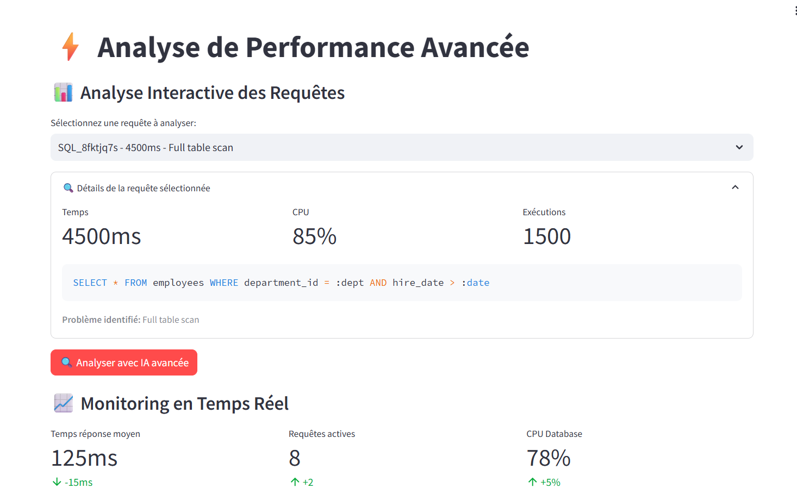

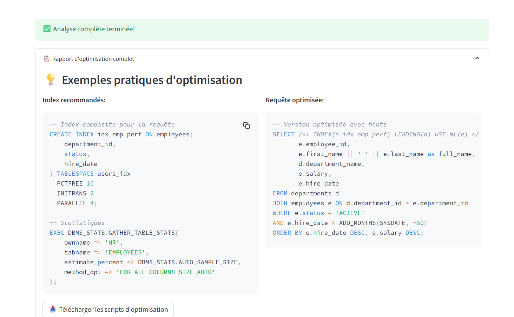

### 4.2. Audit de Sécurité Intelligent

**Fonctionnalités :**

- Analyse automatique de la configuration Oracle

- Détection des risques de sécurité

- Calcul d’un score de sécurité

- Recommandations priorisées


Exemple de rapport :
```text

Score de sécurité : 65/100 (MOYEN)

CRITIQUE : L'utilisateur 'DEV_USER' possède des privilèges DBA
HAUTE : 5 comptes sans expiration de mot de passe

Recommandations :
- Révoquer le rôle DBA de 'DEV_USER'
- Appliquer un profil de sécurité strict

```

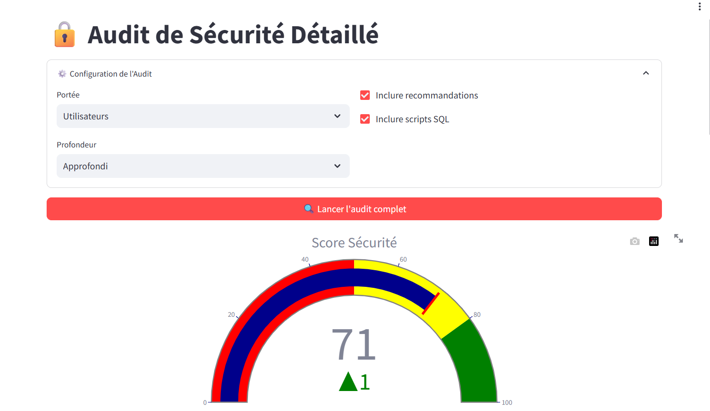

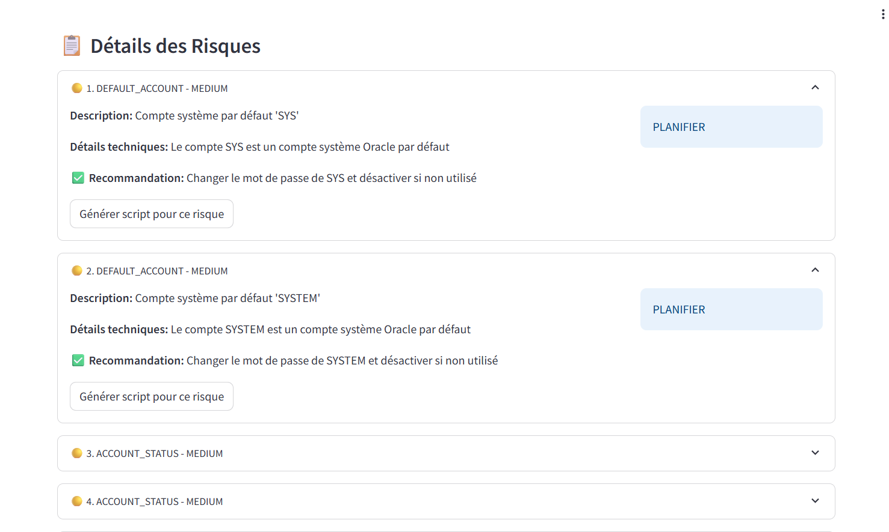

### 4.3. Détection d’Anomalies et Cybersécurité 

**Fonctionnalités :**

- Analyse en temps réel des logs d’audit

- Détection des comportements suspects :

     - tentatives d’injection SQL

     - accès non autorisés

     - escalade de privilèges

- Alertes immédiates

Exemple : 

```text
ALERTE CRITIQUE

Log suspect détecté à 02:34 :
- Utilisateur : 'GUEST'
- Accès tenté à la table 'SALAIRES'
- 15 tentatives en 2 minutes
- Possible injection SQL

→ Action recommandée : bloquer l'utilisateur et investiguer

```

### 4.4. Gestion Intelligente des Sauvegardes 

**Fonctionnalités :**

- Analyse des besoins métier (RTO, criticité des données)

- Génération automatique de stratégies de sauvegarde

- Assistance pas à pas pour la restauration

Exemple :
```text
Utilisateur : "Je dois restaurer ma base au 15 mars à 14h"

IA :
1. Identifier le backup complet du 14 mars
2. Appliquer les archive logs jusqu'à 14h
3. Commande RMAN :
   RECOVER DATABASE UNTIL TIME '15-MAR-2026:14:00:00'
4. Temps estimé : 45 minutes

```
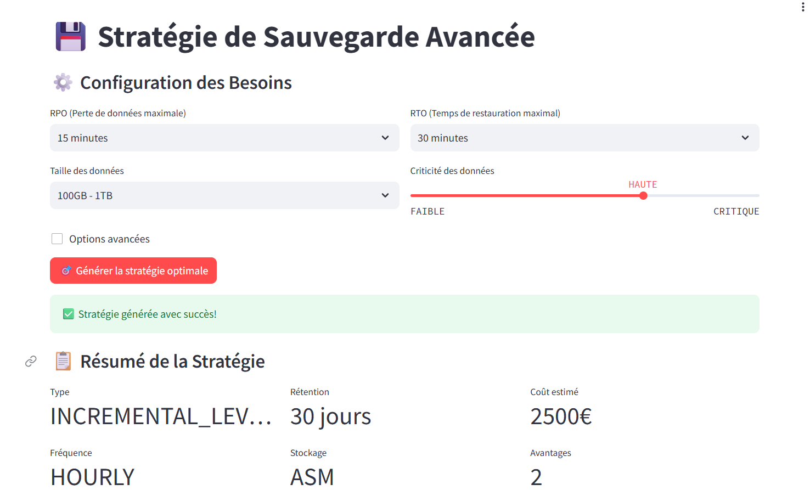

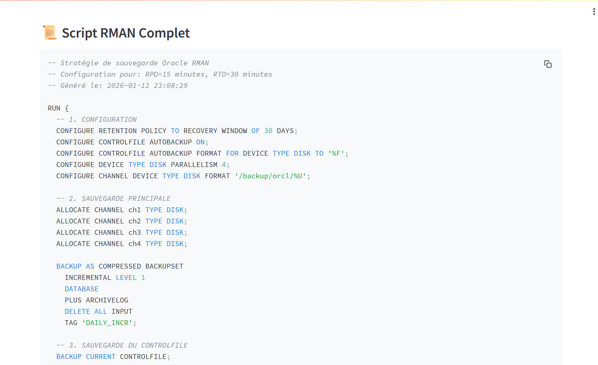

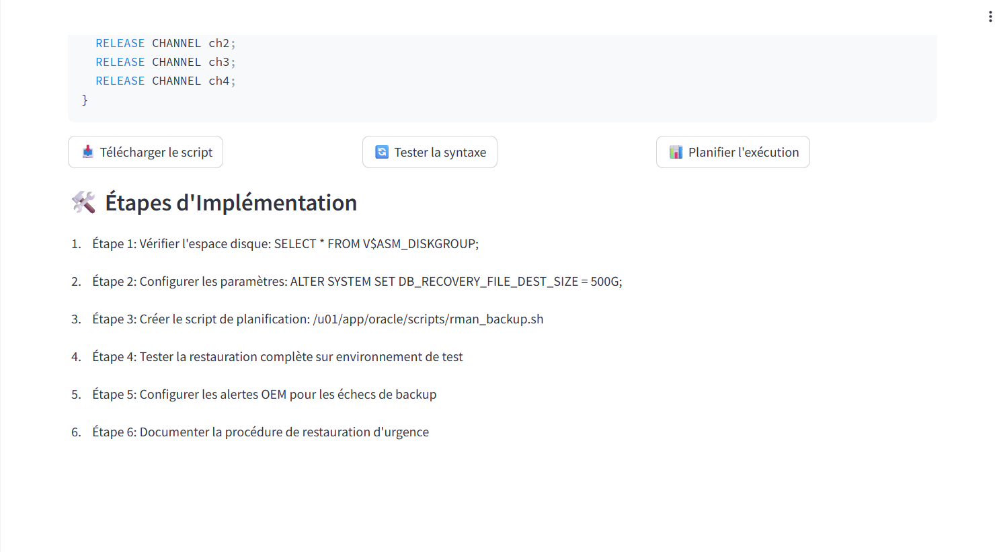

### 4.5. Base de Connaissances Oracle (RAG – Retrieval-Augmented Generation)

La plateforme intègre une Base de Connaissances Oracle intelligente, basée sur l’architecture RAG (Retrieval-Augmented Generation).
Cette base constitue le socle de connaissance technique utilisé par l’IA pour fournir des réponses précises, contextualisées et fiables.

Elle centralise :

- la documentation Oracle,

- les bonnes pratiques DBA,

- des cas réels d’incidents,

- des procédures de performance, sécurité et sauvegarde.

**Fonctionnalités Principales**

- Stockage structuré de documents Oracle

- Indexation vectorielle pour recherche sémantique

- Recherche intelligente par mots-clés ou intention

- Ajout dynamique de nouveaux documents

- Tests de questions pour valider la qualité des réponses IA

- Statistiques détaillées sur le contenu de la base

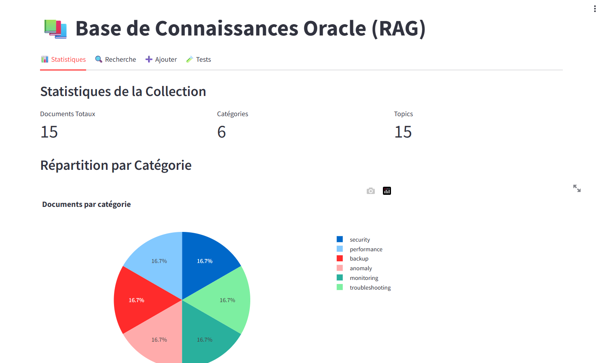

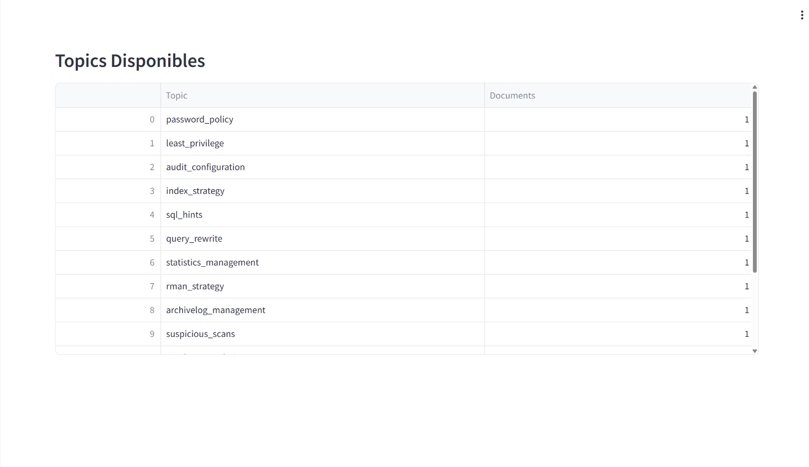

## 5. L'Interface : Le Dashboard et le Chatbot
### 5.1. Le Dashboard (interface visuelle)
Affiche en temps réel :

- Page Accueil : Vue d'ensemble, alertes critiques en rouge
- Page Sécurité : Score de sécurité, liste des risques
- Page Performance : Graphiques des requêtes lentes, tendances
- Page Sauvegardes : État des backups, dernière sauvegarde
- Page de la base de la base de connaissances : constitue le socle de connaissance technique utilisé par l’IA 

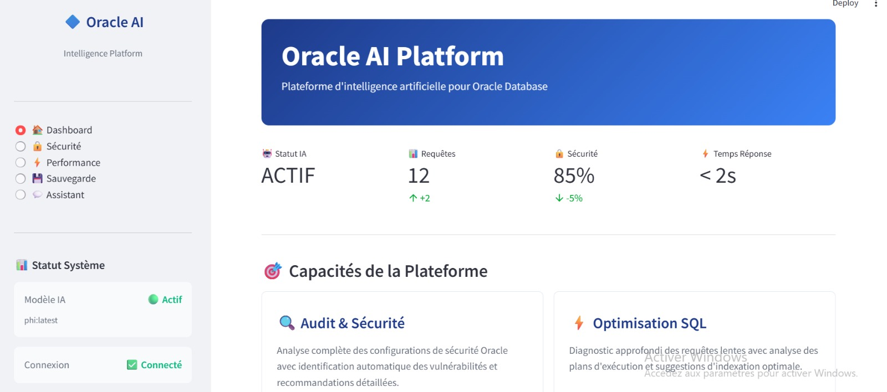

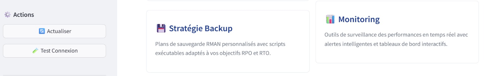

### 5.2. Le Chatbot (conversation naturelle)

Vous pouvez lui poser n'importe quelle question :

```text
"Y a-t-il des tentatives d'intrusion aujourd'hui ?"
"Comment optimiser ma requête sur la table CLIENTS ?"
"Quelle stratégie de sauvegarde pour une base critique ?"
"Explique-moi ce log d'audit suspect"

```

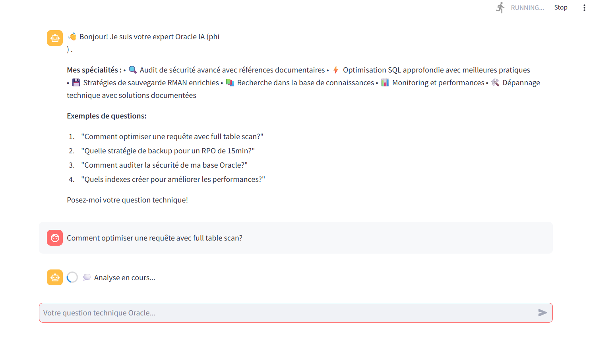

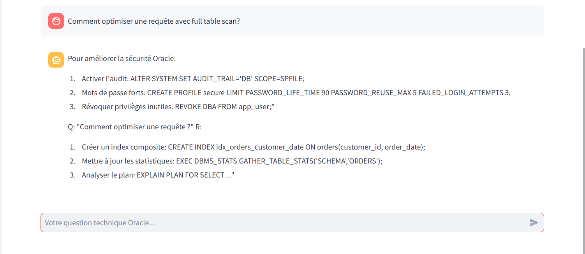

**Voici une petite vue de la génération par l'IA sur la base :**

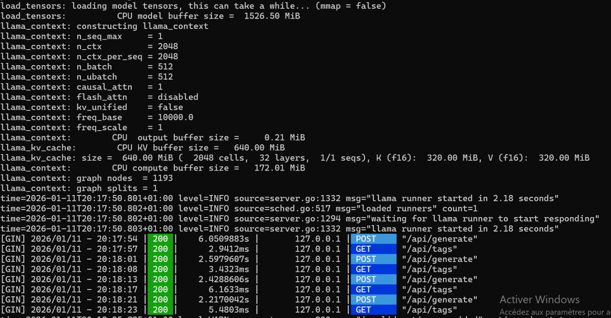


## 6. La Technologie : Comment ça Marche ?

#### L'Intelligence Artificielle (LLM)

Utilise Claude, GPT ou Llama (modèles de langage)
Comprend vos questions en langage naturel
Analyse les données techniques et répond de façon compréhensible

#### RAG (Retrieval-Augmented Generation)

Base de connaissances : documentation Oracle, meilleures pratiques, exemples
Quand vous posez une question, l'IA cherche d'abord dans cette base
Combine sa connaissance générale + documentation spécifique = réponses précises

#### Prompt Engineering

Instructions précises données à l'IA pour chaque tâche
Exemples concrets (few-shot learning) pour améliorer la qualité
Garantit des réponses cohérentes et pertinentes.

## 7. Objectifs du Projet

#### Objectifs Techniques

- Extraction automatique des données Oracle (logs, métriques, configurations)

- Création d’une base de connaissances vectorielle (15–20 documents)

- Intégration d’un LLM capable de répondre à plus de 15 types de questions

- Développement de 9 modules fonctionnels : extraction, RAG, LLM, audit sécurité, optimisation, détection d’anomalies, sauvegarde, restauration, dashboard

- Interface web complète avec chatbot


#### Objectifs Métier

- Réduction du temps d’intervention (heures → minutes)

- Prévention proactive des incidents

- Amélioration continue de la sécurité

- Optimisation automatique des performances

- Assistance fiable à la récupération après pannes

#### Objectifs Pédagogiques

- Maîtrise du Prompt Engineering

- Compréhension de l’architecture RAG

- Approfondissement de l’administration Oracle

- Développement d’une application fullstack avec IA

#### Le Produit Final

- Une application web complète où :

- L’utilisateur se connecte à sa base Oracle

- Le dashboard affiche les métriques clés

- Un chatbot IA répond aux questions en langage naturel

- Des alertes sont générées en cas de problème

- Des recommandations concrètes sont proposées

## 8. Conclusion

Cette plateforme agit comme un expert Oracle disponible 24/7, capable de surveiller la base, détecter les problèmes avant qu’ils ne deviennent critiques, et guider l’administrateur pas à pas, avec un langage simple et compréhensible.

### Réalisé par :

- **OUEDRAOGO Youssahou**

- **RAHELIARISOA Andriamasy Lorraine Agnès** 
 
 Deuxième année – Cycle Ingénieur  
 Filière : **LSI (Logiciels et Systèmes Intelligents)**  à la  Faculté des Sciences et Techniques de Tanger

### Encadré par :
 **Professeur Mohamed BEN AHMED**
 
 **Module Administration de la base de données Oracle**
